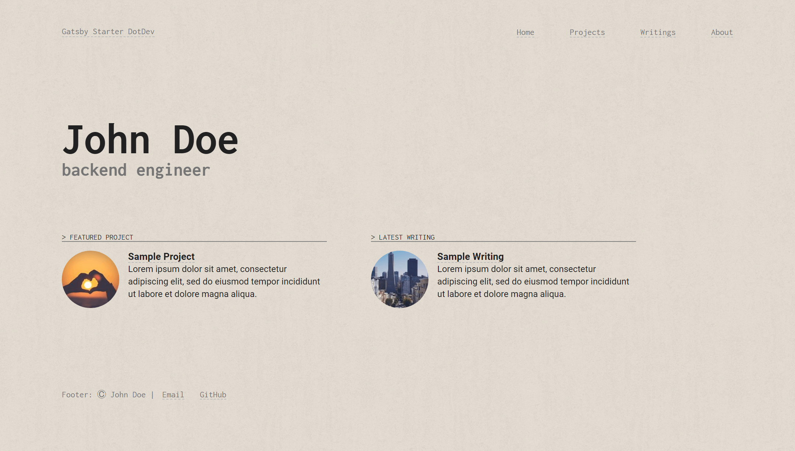
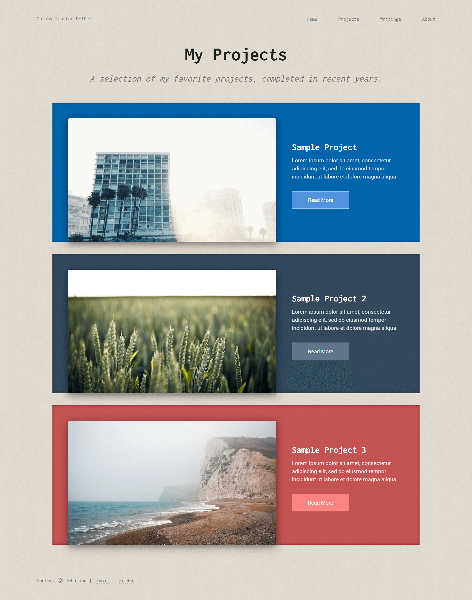
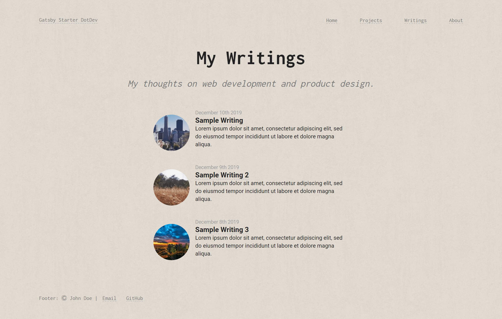
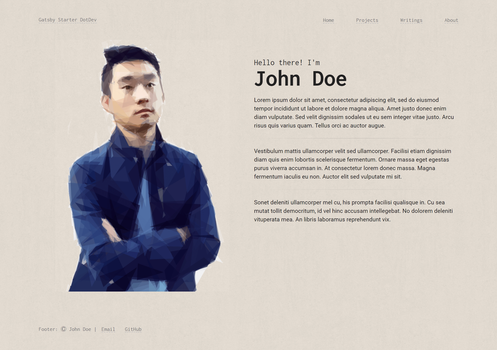

# Gatsby Starter: DotDev

> Personal site template for developers. Showcase your projects and writings.






## Live Demo

* [Gatsby Starter DotDev (this repo)](https://gatsby-starter-dotdev.kennethwang.dev)
* [KennethWangDotDev (my personal site)](https://kennethwang.dev)

## Install

```
yarn
yarn start
```

## Theme

This repository contains the starter (example site) for [Gatsby Theme DotDev](https://github.com/KennethWangDotDev/gatsby-theme-dotdev).

## Features

* Tablet & mobile friendly
* Typography best practices
* SEO
* MDX
* Optimized images with gatsby-image
* Netlify deployment friendly
* Good Developer Experience
  * ESLint + Prettier + TypeScript
  * React functional components + hooks
  * styled-components
  * Webpack path alias

## Customization

Most text and SEO fields are configurable through the siteMetadata object in [gatsby-config.js](./gatsby-config.js).

Project entries are located in `content/projects`, and writing entries in `content/writings`.

The About page text can be changed via shadowing, like [here](./src/gatsby-theme-dotdev/texts/bio.mdx). The picture in the About page is set [here](./content/assets/avatar.png).

For more advanced customizations, I recommend you fork [Gatsby Theme DotDev](https://github.com/KennethWangDotDev/gatsby-theme-dotdev).
